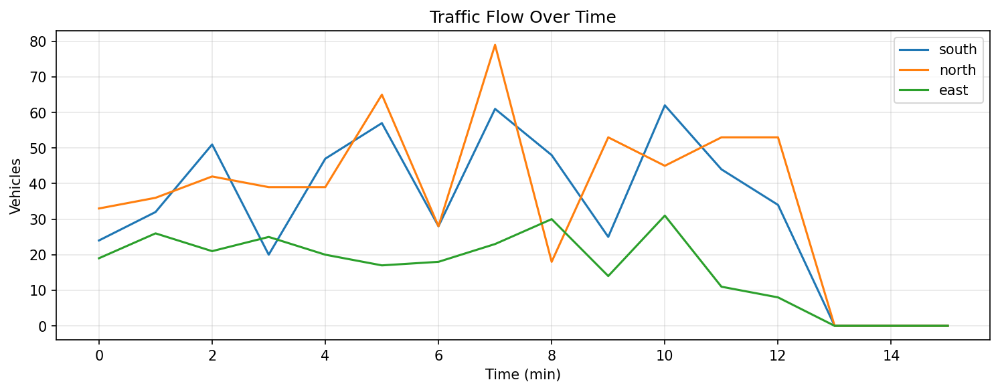
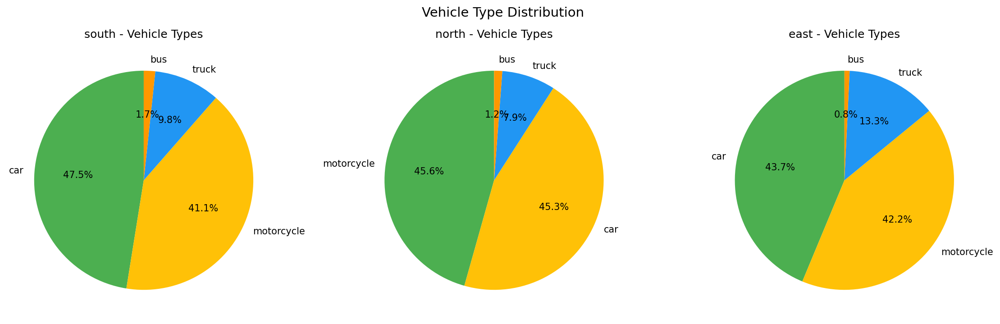
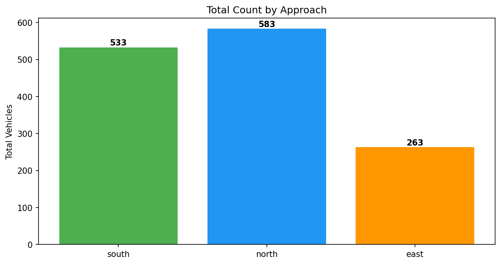

# TrafficFlow Analyzer v1.0.0

基于 **YOLO11 + ByteTrack + 双绊线** 的交通路口车辆检测/跟踪/计数系统。

## 效果案例

在 T 型路口 3 路 4K 视频（各 15 分钟）上测试，yolo11x + 4K 输入：

| 摄像头 | 总数 | car | bus | truck | motorcycle |
|--------|------|-----|-----|-------|------------|
| 南进口 | 533 | 253 | 9 | 52 | 219 |
| 北进口 | 583 | 264 | 7 | 46 | 266 |
| 东进口(支路) | 263 | 115 | 2 | 35 | 111 |
| **合计** | **1379** | 632 | 18 | 133 | 596 |





处理速度: 16-18 fps @ RTX 4060 Laptop 8GB

## 功能特性

- **YOLO11 多模型可选**: n(最快) / s / m / l / x(最准)，4K 输入
- **ByteTrack 跟踪**: 匈牙利全局最优匹配 + Kalman 预测，抗遮挡
- **多段折线绊线**: A 线(进入确认) → B 线(触发计数)，点击式标定
- **硬 ROI 车道掩膜**: 仅统计合法车道内车辆
- **转弯车免疫**: 已穿 A 线车辆保留至计数完成
- **CPU/GPU 并行**: 帧预取线程 + GPU 批量推理
- **输出**: 带检测叠加的视频 + 流量图表 + CSV 报告

## 下载安装

### 方式一：安装器 (推荐)

从 [Releases](https://github.com/rafiqxin/traffic-flow-analyzer/releases) 下载 `TrafficFlowAnalyzer_Setup_v1.0.0.exe`，双击运行。

安装向导会自动：
1. 安装 Miniconda
2. 创建 Python 环境
3. 下载 PyTorch + CUDA 依赖
4. 创建桌面快捷方式

安装时间约 15-20 分钟（需网络下载 PyTorch ~2GB）。

### 方式二：源码安装

```bash
git clone https://github.com/rafiqxin/traffic-flow-analyzer.git
cd traffic-flow-analyzer
pip install -r requirements.txt
python desktop_app.py
```

依赖: Python 3.10+, NVIDIA GPU, CUDA 12.1+

## 使用说明

### 桌面版

```bash
python desktop_app.py
```

1. **选择视频文件**
2. **提取标定帧** → 在画面上点击标定 A 线(黄) 和 B 线(红)
   - 左键添加顶点 → 右键完成折线
   - 支持撤销/清除
3. **选择模型** (n/s/m/l/x) 和参数
4. **开始检测** → 查看输出视频、图表、统计

### 命令行

```bash
# 单摄像头
python main.py --camera south --batch 16

# 全部摄像头  
python main.py --camera all --batch 8 --device cuda:0
```

### 标定工具

```bash
python calibrate_roi.py --camera south
```

## 技术架构

```
视频 → FramePrefetcher(CPU预取) → YOLO批量推理(GPU)
     → ByteTrack(匈牙利+Kalman) → ROI过滤(硬掩膜+双绊线)
     → 统计输出(图表+CSV+视频)
```

## 项目结构

```
├── desktop_app.py      # 桌面版 (PyQt6)
├── main.py             # CLI 入口
├── pipeline.py         # 可编程管线
├── calibrate_roi.py    # 独立标定工具
├── setup_wizard.py     # 安装向导源码
├── config/
│   ├── model_config.yaml
│   └── camera_roi.yaml
├── src/
│   ├── detector.py     # YOLO检测 + 帧预取
│   ├── tracker.py      # ByteTrack 跟踪
│   ├── roi_filter.py   # ROI掩膜 + 双绊线
│   ├── visualizer.py   # 可视化
│   └── data_processor.py
├── docs/images/        # 效果截图
└── output/             # 输出目录
```

## License

MIT License
